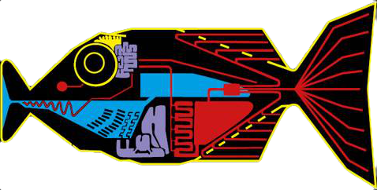

# BabelFish

A proof of concept, parser and compiler to provide a means for compile time protection for localization strings for Xcode projects

  

# Why?

Because string literals in code are dangerous, it's too easy to make a typo and there's no way to know until after you've run the code, which, in a suitably complex code base, might not always be picked up immediately.

Localization keys are prone to change and removal, again, there is no compile time check to catch this and these changes could go unnoticed for some time.

The intention is to take something like…

    placeholderLabel.text = "Label.Select".localized()

and replace it with something more robust, for example…

    placeholderLabel.text = Localized.Label.select.localized()

This approach would also have support for parameter and plural based localisations, for example...

    "TimeOffRequest.Label.Type(%@)".localized(timeOffSubType.name).localized()

would become

    Localized.TimeOffRequest.Label.typeWith(timeOffSubType.name).localized()

and 

    "Label.(%d)YearsOld".localized(Day.today.years(since: birthday))

would become 

    Localized.Label.yearsOldPluralWith(Day.today.years(since: birthday)).localized()
    
# Parameters

Localization keys with parameters are inspected and an attempt is made to determine the parameter type (based on [String Format Specifiers](https://developer.apple.com/library/archive/documentation/Cocoa/Conceptual/Strings/Articles/formatSpecifiers.html)), where the parameter type can't be determine, it's parameter type is defaulted to `CVarArg`

# Ouput

The project is intended to be able to parse multiple localization sources (bundle based) and generate a `.swift` file which can then be included in the project.

## `enum`

This outputs the localisations into groups of `enum`s, under a master `Localized` `enum`

Because of the way `enum` works, it is required that an additional call is needed to perform the actually tranlsation, for example, `Localized.TimeOffRequest.Label.typeWith(timeOffSubType.name)` would require a call to `.localized()` to generate the localized `String`.

### `enum` draw backs

    /// Level (%d/%d)
    case level(_ p0: Int, _ p1: Int)
    /// Level %d
    case level(_ p0: Int)
    /// Level
    case level
    
Would all be considered the "same" case, to this end, the API needs to make a number of "assumptions" in order to over come it, for example...

    /// Level (%d/%d)
    case levelOfWith(_ p0: Int, _ p1: Int)
    /// Level %d
    case levelWith(_ p0: Int)
    /// Level
    case level

We also have the same issue with the plural terms, which means they tend to have `PluralWith` appended to the key name

## `struct`

This outputs the localisations into groups of `struct`s, under a master `Localized` `struct`

This approach internally generates the localized `String`, so you'd only need to call `Localized.TimeOffRequest.Label.typeWith(timeOffSubType.name)` and the function would automatically load the translation for the specified key.

This approach is generally simpler, as the `enum` approach requires a significant amount of additional "boiler plate" code (under the hood) to achieve the same result and the `struct` approach will automatically return the translated `String` without a need for an additional function call.

## Which to use?

Which ever makes the most sense to you
 
# Helpful hints

The code generator will also include the "term" (in this case, the English term) as part of the key's documentation, for example...

    public enum Alert {
        /// Sorry, this shift type is not supported for approval workflow
        case unsupportedShiftTypeForApprovalWorkflow

# Preperations

In order to lookup the translations from different bundles, each bundle requires a means by which it can be identified.

To achieve this, it's required that each bundle provide a simple `static` identifier, for example...

    extension Bundle {
        public static var local: Bundle { return Bundle.main }
    }

The code generator will then make use of this identifier when calling `NSLocalizedString` for a given key.

# What doesn't it do?

The code generator DOES NOT actively monitor for duplicate keys, if duplicate keys do exist, then the resulting code simply won't compile.

# Command line arguments

The intention is to provide as simple an experience as possible, while maintaining the overall goals the project.

The command requires at least three parameters

- `--output`: This specifies the designed output, valid options include `struct` and `enum`
- `--source`: This is the source path to the directory which contains `en.lproj` directory.  BableFish will use `en.lproj` as a bases for the translations
- `--bundle`: This is the bundle identifier to use when translating the strings.  In most cases `main` will be acceptable.  If you're combining multiple projects, then each project will need to include it's `Bundle.{identifier}` which can then be specified on the command line.  BableFish will then use `Bundle.{identifier}` in it's output

## Supporting multiple targets

BableFish allows you merge multiple projects together, to do this, the `--source` and `--bundle` allow for an optional numeric identifier (ie `--source1` and `--bundle1`).  The value of the identifier is irrelevent, it's only required that one `--source` and `--bundle` pair have the same identifier, for example...

`BableFish --output struct --source1 path/to/first/project --bundle1 main --source2 path/to/second/project --bundle2 subProject`
